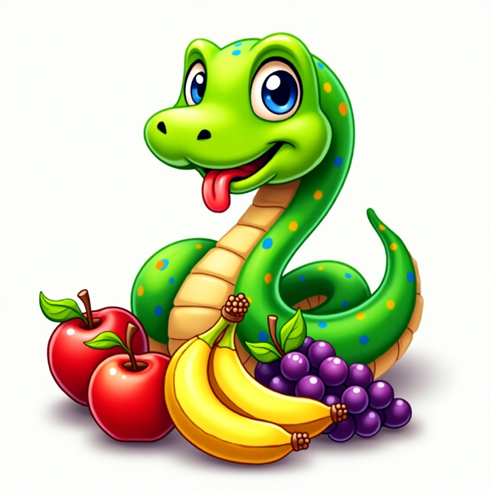
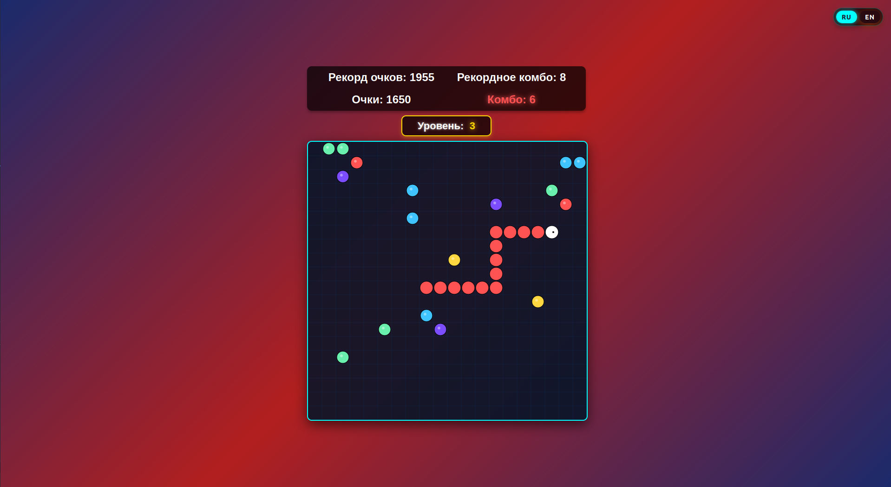

# Chameleon Snake Game

**License**: MIT  
**Created by**: Ярослав Зотов
**AI Collaboration**: концепт игры, генерация кода и макета - DeepSeek  
**Technology**: чистый JavaScript - не требуется никаких библиотек, фреймворков или Node.js

## 🎮 Game Overview

Хамелеон-Змейка - это инновационный поворот в классической игре "Змейка" с механикой изменения цвета и системой комбо. Съедайте фрукты своего цвета, чтобы получать бонусы и повышать свой рекорд!

## ✨ Ключевые особенности

- **Color-Changing Mechanics**: Змейка меняет цвет при каждом съеденном фрукте
- **Combo System**: Получайте бонусные очки за серию фруктов одного цвета
- **Progressive Levels**: Игра ускоряется с каждым новым уровнем
- **Multi-language Support**: Русский и английский интерфейсы
- **Local Storage**: Сохранение рекордов в браузере
- **Responsive Design**: Адаптируется под разные размеры экрана

## 🎯 Геймплей

### Основные правила:
1. Управляйте змейкой с помощью стрелок ←↑↓→
2. Съедайте фрукты, чтобы расти и получать очки
3. При съедении фрукта змейка меняет цвет на цвет фрукта
4. Съедайте несколько фруктов одного цвета подряд для комбо-бонусов
5. Избегайте столкновений с собственным телом!

### Система очков:
- Обычный фрукт: +10 очков
- Комбо: +15-1500 очков (в зависимости от длины серии)
- Уровень: Повышается при достижении определенной длины змейки

## 🤖 Вклад ИИ

Этот проект был создан при ключевом участии **DeepSeek AI** в следующих аспектах:

### Генерация кода:
- Полная кодовая база на чистом JavaScript
- Архитектура игры и структура проекта
- Алгоритмы движения и коллизий
- Система комбо и подсчета очков

### Дизайн и концепция:
- Механика изменения цвета
- UX/UI дизайн интерфейса
- Цветовые схемы и визуальные эффекты
- Локализация (русский/английский)

## 🚀 Технологический стек

### Что ИСПОЛЬЗУЕТСЯ:
- **Чистый HTML5** - разметка и структура
- **Vanilla JavaScript** - игровая логика без фреймворков
- **CSS3** - стили и анимации
- **Canvas API** - отрисовка игрового поля

### Что НЕ используется:
- ❌ React, Angular, Vue или другие фреймворки
- ❌ Node.js и npm пакеты
- ❌ Внешние библиотеки (jQuery, Three.js и т.д.)
- ❌ Сборщики (Webpack, Vite, Gulp)
- ❌ Компиляторы и транспайлеры

## 📁 Установка и запуск

### Самый простой способ:

1. Откройте https://qiray.github.io/color-snake/
2. Начните играть!

### Чуть посложнее:

1. Скачайте все файлы проекта с https://github.com/qiray/color-snake/
2. Откройте `index.html` в любом современном браузере
3. Начните играть!

## 🎨 Ресурсы и атрибуция

### Графика:
- **Логотип и иконка**: Сгенерированы с помощью Leonardo.AI
- **Игровые элементы**: Созданы программно через Canvas

### Звуковые эффекты:
- Все звуки предоставлены [Mixkit.co](https://mixkit.co) под бесплатной лицензией

### Шрифты:
- Системные шрифты Arial и Arial Rounded MT Bold

## 📈 Планы развития

### Ближайшие обновления:
- [x] Мобильная версия с сенсорным управлением
- [ ] Новые игровые элементы (бомбы, стены, ускорители)
- [ ] Фоновая музыка и настройки звука

## 👥 Участники проекта

- **Yaroslav Zotov** - идея, координация, финальная реализация
  - GitHub: [qiray](https://github.com/qiray)
  
- **DeepSeek AI** - генерация кода, дизайн, архитектура
  - Website: [deepseek.com](https://www.deepseek.com/)
  
- **Leonardo.AI** - генерация изображений для логотипа
  - Website: [leonardo.ai](https://leonardo.ai/)
  
- **Mixkit** - звуковые эффекты
  - Website: [mixkit.co](https://mixkit.co)

## 📄 Лицензия

Этот проект распространяется под лицензией **MIT**.

См. файл [LICENSE.txt](LICENSE.txt)

## 🤝 Вклад в проект

Хотя этот проект был сгенерирован с помощью ИИ, мы приветствуем:
- Сообщения об ошибках и багах
- Предложения по улучшению геймплея
- Идеи для новых функций
- Переводы на другие языки

## 💡 Почему Vanilla JS?

Мы сознательно отказались от фреймворков чтобы:
- **Минимизировать размер** - всего 6 файлов, < 100KB
- **Упростить запуск** - не требуется установка зависимостей
- **Повысить производительность** - прямой доступ к Canvas API
- **Образовательные цели** - чистый, читаемый JavaScript
- **Совместимость** - работает везде где есть браузер

## 📞 Контакты

По вопросам сотрудничества, предложениям или помощи:
- GitHub Issues: [Создать issue](https://github.com/qiray/color-snake/issues)
- Email: [zotovyaa@mail.ru](mailto:zotovyaa@mail.ru)

---

**Примечание**: Этот проект демонстрирует возможности AI-ассистентов в разработке игр и служит примером того, как современные инструменты могут ускорять творческий процесс.

*Последнее обновление: 2026*

**PS.** Файл README также сгенерирован с помощью DeepSeek с моими минимальными правками.
